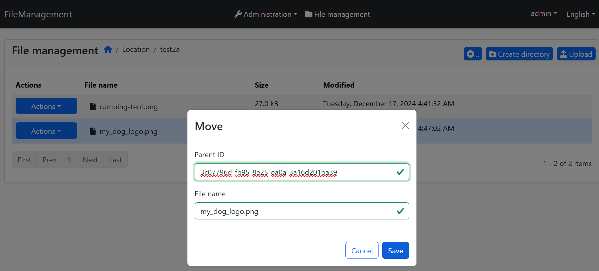

# Syrna.FileManagement
File Management module for ABP framework.

 

An abp application module that allows manage blobs.

## Installation

1. Install the following NuGet packages. ([see how](https://github.com/SyrnaAbp/SyrnaAbpGuide/blob/master/docs/How-To.md#add-nuget-packages))

    * Syrna.FileManagement.Application
    * Syrna.FileManagement.Application.Contracts
    * Syrna.FileManagement.Domain
    * Syrna.FileManagement.Domain.Shared
    * Syrna.FileManagement.EntityFrameworkCore
    * Syrna.FileManagement.HttpApi
    * Syrna.FileManagement.HttpApi.Client
    * Syrna.FileManagement.Web
    * Syrna.FileManagement.Blazor
    * Syrna.FileManagement.Blazor.Server
    * Syrna.FileManagement.Blazor.WebAssembly

1. Add `DependsOn(typeof(FileManagementXxxModule))` attribute to configure the module dependencies. ([see how](https://github.com/SyrnaAbp/SyrnaAbpGuide/blob/master/docs/How-To.md#add-module-dependencies))

1. Add `builder.ConfigureFileManagement();` to the `OnModelCreating()` method in **MyProjectMigrationsDbContext.cs**.

1. Add EF Core migrations and update your database. See: [ABP document](https://docs.abp.io/en/abp/latest/Tutorials/Part-1?UI=MVC&DB=EF#add-database-migration).

## Usage

## Reference

### This project based on [EasyAbp FileManagement](https://github.com/EasyAbp/FileManagement)

### Differences

1. Demo project created for OpenIddict
2. Demo project extended modules added
3. Razor pages implemented
4. Added Image Viewer to blazor UI
5. Added Text Viewer to blazor UI
6. Exception improvments 
7. Localization improvments 
8. Added Turkish localization
9. Uploader improments for blazor UI

